# **Lost Limb Riders Handbook**

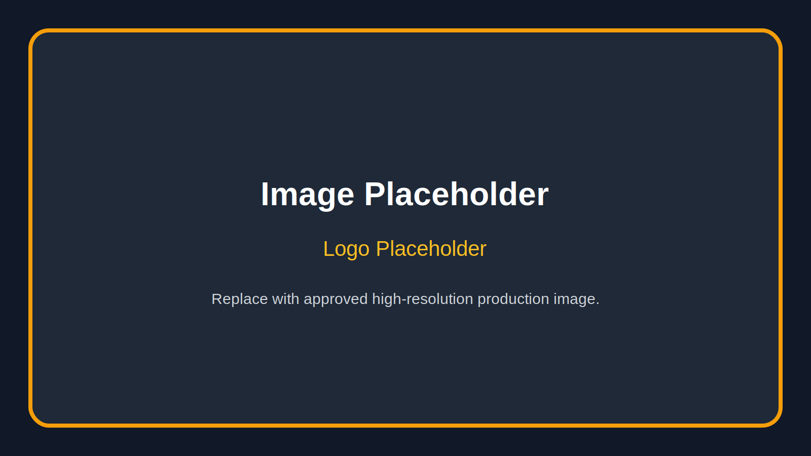

**Motto:** “I Can. I Will.”  
**Tagline:** “Nobody Is Left Behind. Nobody Stands Alone.”  
**Prepared for:** Sponsors, grant partners, corporate partners, hospitals, prosthetic providers, motorcycle organizations, donors, volunteers, media, and community leaders  
**Document type:** Organizational handbook and partnership overview  

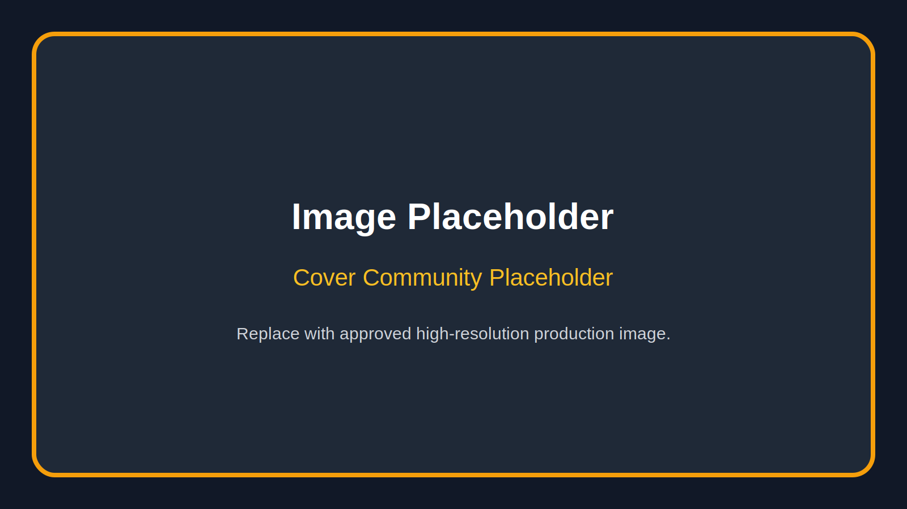

## **How to Use This Handbook**

This handbook is designed to introduce Lost Limb Riders with clarity, heart, and credibility. It explains who we are, why we exist, what we do, and how partners can stand with us. It is intended for board members, volunteers, donors, sponsors, hospitals, rehabilitation centers, prosthetic companies, motorcycle organizations, civic groups, media outlets, and every person who wants to understand the movement behind the name.

Lost Limb Riders is more than an organization. It is a statement of survival. It is a promise made to people who have been through the kind of pain that changes a life from the inside out. It is a brotherhood and sisterhood built around dignity, courage, practical support, and the belief that nobody should have to rebuild alone.

Where final personal details are still needed, this handbook uses clear placeholders. Those placeholders should be replaced with the founder’s confirmed dates, biographical details, photographs, organizational data, partner names, and approved financial information before public distribution.

**Recommended final production assets:**  
Official logo file  
Founder portrait  
Community ride photography  
Volunteer or hospital visit photography  
Program photographs  
Sponsor recognition graphic  
Approved nonprofit registration details  
Board and staff names  
Contact information  
Website and social media links  

## **Table of Contents**

Cover Page  
Letter from the Founder  
Chapter 1: Our Story  
Chapter 2: The Reality of Limb Loss  
Chapter 3: Why Lost Limb Riders Exists  
Chapter 4: Mission, Vision & Values  
Chapter 5: The Lost Limb Riders Promise  
Chapter 6: Brotherhood and Sisterhood in Community  
Chapter 7: Programs  
Chapter 8: Speaking and Public Awareness  
Chapter 9: Events  
Chapter 10: Corporate Partnerships  
Chapter 11: Financial Stewardship  
Chapter 12: Five‑Year Vision  
Chapter 13: Founder Biography  
Chapter 14: Call to Action  
Appendix A: Image Placement Guide  
Appendix B: Partner One‑Sheet Copy  
Appendix C: Volunteer Commitment Statement  

# **Letter from the Founder**

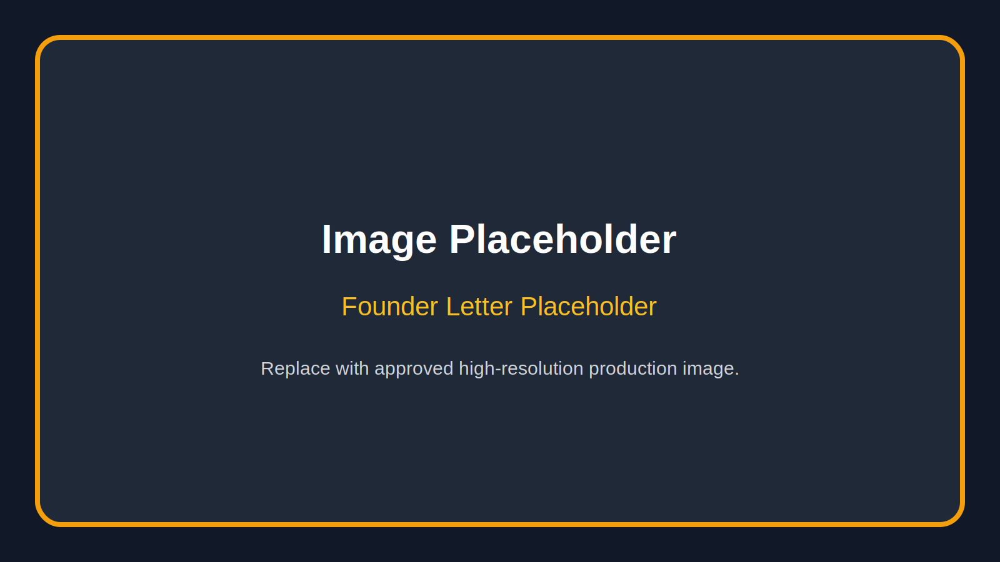

Dear friend,

Lost Limb Riders was born from a truth I learned the hard way: healing is not just medical. Healing is physical, mental, emotional, financial, spiritual, and deeply personal. It happens in hospitals and rehabilitation centers, but it also happens in garages, parking lots, living rooms, churches, workplaces, and on the open road when somebody finally feels the wind again and remembers they are still alive.

There are moments after limb loss when the world gets quiet in a way most people cannot understand. The body changes. The routines change. The mirror changes. The future you thought you were walking toward can suddenly feel far away. Family members want to help, but they do not always know what to say. Friends may mean well, but they may not understand the fight it takes to get through an ordinary day. Bills arrive. Appointments stack up. Pain comes and goes. Confidence can feel like something that belongs to the person you used to be.

I know what it means to need someone who understands without needing a long explanation. I know what it means to wonder whether life will ever feel full again. I also know what it means to discover that strength is not the absence of struggle. Strength is deciding, one day at a time, that your story is not over.

That is why Lost Limb Riders exists.

I created the organization I wish someone had introduced me to when I needed it most.

Lost Limb Riders is for the amputee who is newly injured and terrified. It is for the person who has lived with limb loss for years but still feels alone. It is for the veteran trying to find a new sense of mission. It is for the parent who wants their child to believe a full life is still possible. It is for spouses, caregivers, friends, and families who need support too. It is for riders and non‑riders. It is for people who love motorcycles and people who have never been near one. The motorcycles are part of our culture, but they are not the whole story. The real story is people helping people stand back up.

Our motto is simple: “I Can. I Will.” Those four words are not a slogan for a shirt. They are a decision. They are what a person says when the road ahead looks impossible but something inside refuses to quit. Our tagline is just as important: “Nobody Is Left Behind. Nobody Stands Alone.” That is the culture we are building. That is the promise we make.

This handbook explains our mission, our programs, our values, our vision, and the kind of partnerships we are seeking. We are building something that can serve people today and still be standing ten years from now. We want to work with sponsors who care about measurable impact, hospitals that want stronger community support for patients, prosthetic providers who believe confidence matters as much as equipment, motorcycle organizations that understand brotherhood and service, and volunteers who are ready to show up with compassion and consistency.

If you are reading this, I invite you to see more than a nonprofit proposal. See a person walking into a room full of strangers and realizing they have finally found people who understand. See a family breathing for the first time because they are no longer carrying the weight alone. See a rider getting back on the road. See a community choosing to make sure hope has somewhere to live.

Thank you for taking the time to learn about Lost Limb Riders. Thank you for considering how you might stand with us. And thank you for believing, as we do, that life after limb loss can still be bold, connected, purposeful, and free.

With respect and determination,

**[Founder Name]**  
Founder, Lost Limb Riders  
**“I Can. I Will.”**

# **Chapter 1: Our Story**

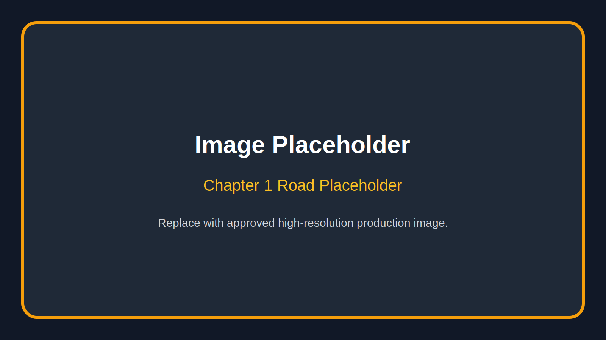

Every organization has a beginning, but the best ones are not born in conference rooms. They are born from lived experience. They begin when someone goes through something hard enough to change them, then decides that pain will not be wasted.

Lost Limb Riders began with a life interrupted. Before limb loss, life had its own rhythm. There were routines, work, relationships, plans, and the ordinary confidence of moving through the world without needing to explain your body to anyone. There was independence that did not feel like independence because it had never been threatened. There were goals that seemed reachable because the road ahead looked familiar.

Then everything changed.

Limb loss does not only take a limb. It can take certainty. It can take privacy. It can take sleep. It can take the ease of walking into a room without feeling watched. It can take work opportunities, hobbies, balance, confidence, and the simple ability to move through the day without planning every step. It can make a person feel like life has been divided into before and after.

The early days after limb loss can be filled with medical language, appointments, pain management, insurance forms, equipment decisions, and advice from people who may care deeply but do not fully understand. Recovery can feel like being handed a map written in a language you are still learning. The body has to adapt. The mind has to process. The heart has to grieve. Family members have to adjust too, often while trying to stay strong for the person they love.

But somewhere inside that struggle, another truth begins to appear: the human spirit is not measured by what has been taken. It is measured by what rises afterward.

Recovery teaches lessons nobody signs up to learn. It teaches patience because progress is rarely fast. It teaches humility because help becomes necessary in ways that may feel uncomfortable. It teaches courage because ordinary tasks can become daily battles. It teaches discernment because not every voice around you understands what hope should sound like. And it teaches resilience because the body may change, but purpose can survive.

Lost Limb Riders was created from that place of hard‑earned understanding. It was not built to pity people. It was built to walk with them. It was not created to treat amputees like projects. It was created to treat them like whole human beings with stories, families, dreams, fears, humor, grit, and futures worth fighting for.

The name carries two important truths. “Lost Limb” honors the reality of amputation without hiding from it. It says plainly that something happened, something painful and life‑altering, and we are not afraid to name it. “Riders” represents motion, freedom, courage, and community. It points to motorcycle culture, but it also points to anyone determined to keep moving forward. A rider is not just someone on a bike. A rider is someone who refuses to be parked by hardship.

At the heart of this story is a sentence that belongs in every introduction to the organization:

> “I created the organization I wish someone had introduced me to when I needed it most.”

That sentence matters because it is not marketing language. It is the reason. It tells partners, donors, volunteers, and families that Lost Limb Riders was formed from a real gap in support. It tells new amputees that they are not being approached by people who only studied their experience from a distance. They are being welcomed by people who understand that recovery is more than a hospital discharge plan.

Lost Limb Riders exists because there are people who leave medical care and still need community. There are people who receive a prosthetic and still need confidence. There are people who survive trauma and still need purpose. There are people who smile in public but carry fear in private. There are families who need someone to tell them that what they are feeling is normal and that they are not failing.

The story of Lost Limb Riders is still being written. It will be written through hospital visits, support meetings, mentorship calls, community rides, fundraising events, speaking engagements, adaptive recreation opportunities, family days, and quiet conversations where one person looks another in the eye and says, “You are not alone.”

This organization is not built on the idea that every day is easy. It is built on the belief that hard days should not have to be faced in isolation. It is not built on pretending limb loss does not hurt. It is built on proving that pain can become purpose when community shows up.

Lost Limb Riders is the road after the wreck, the hand on the shoulder, the engine starting again, the family finding its breath, the volunteer making the call, the sponsor making services possible, and the amputee realizing that the future still has miles left in it.

# **Chapter 2: The Reality of Limb Loss**

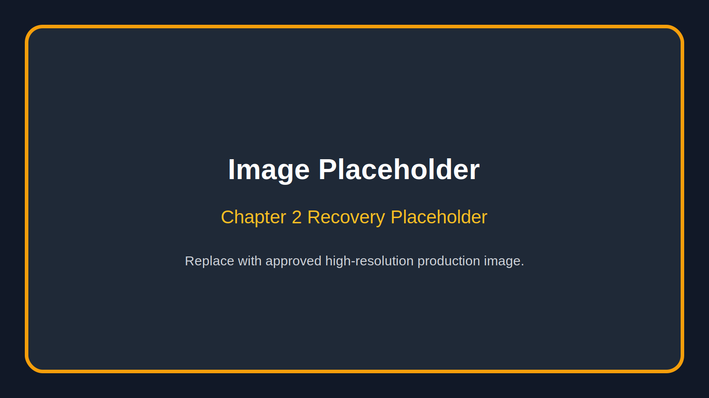

Limb loss is often described in visible terms. People notice the prosthetic, the wheelchair, the crutches, the altered gait, or the missing arm or leg. What they do not always see is the full weight of the experience. Limb loss is physical, but it is never only physical. It reaches into identity, finances, family life, employment, transportation, confidence, intimacy, faith, and mental health.

Physical recovery can begin immediately, but it rarely follows a straight line. The body may be healing from surgery, trauma, infection, illness, or complications that led to amputation. There may be wound care, swelling, nerve pain, phantom limb sensations, balance challenges, muscle loss, fatigue, and repeated appointments. For some, the road to a prosthetic is quick. For others, it is delayed by healing issues, insurance approvals, transportation barriers, or other health conditions.

Even when a prosthetic becomes available, it is not an instant solution. A prosthetic limb is a powerful tool, but it takes fitting, training, patience, and adjustment. Sockets may need changes. Skin may break down. Alignment may need correction. A person may have to learn how to walk, climb, lift, grip, ride, work, or exercise in a new way. Success depends not only on technology, but also on coaching, encouragement, access, and persistence.

Mental health is just as important. Limb loss can bring grief, anger, anxiety, depression, shame, fear, and trauma. A person may grieve the body they had before. They may replay the accident, diagnosis, surgery, or hospital experience. They may worry about being seen differently. They may feel pressure to act strong before they have had time to be honest. They may hear people call them inspiring when what they really need is permission to say, “I am struggling today.”

Isolation is one of the most dangerous parts of the journey. It can happen even when people are surrounded by loved ones. Isolation begins when a person believes nobody around them truly understands. It grows when they stop going places because access is difficult or because they are tired of questions. It deepens when friends stop calling, when activities feel out of reach, when transportation becomes complicated, or when shame convinces someone to stay home.

Family members carry their own burden. Spouses may become caregivers overnight. Parents may feel fear for their child’s future. Children may not understand why the person they love is in pain or moving differently. Families may face financial pressure, emotional exhaustion, and uncertainty about how much help to give. They may need guidance on how to support without taking away independence and how to encourage without minimizing pain.

Financial burdens can be severe. Medical bills, prosthetic costs, travel expenses, home modifications, vehicle adaptations, time away from work, lost income, medication, therapy, and durable medical equipment can create pressure at the exact moment a family has the least emotional bandwidth. Even insured individuals can face deductibles, denials, delays, and uncovered needs. For those without strong insurance or stable employment, the financial cliff can be devastating.

Returning to work is another major challenge. Some people can return to the same role with accommodations. Others must retrain, change careers, or fight for workplace accessibility. Employers may want to help but lack experience. Co‑workers may be supportive but awkward. The person returning may feel pressure to prove they are still capable while managing fatigue, pain, appointments, and a changing sense of identity.

Confidence is rebuilt through repeated moments of success. It does not always return because someone gives a motivational speech. It returns when a person gets through the grocery store alone. It returns when they attend an event and feel welcomed instead of stared at. It returns when they meet another amputee who has made it further down the road. It returns when they try something they thought was gone forever and discover a new way forward.

Lost Limb Riders recognizes the whole picture. We do not reduce people to their injuries. We do not treat prosthetics as the end of the story. We do not pretend a smile means everything is fine. We believe recovery must include belonging, practical support, peer connection, family awareness, public education, adaptive opportunity, and long‑term encouragement.

The reality of limb loss is hard. But hard does not mean hopeless. With the right support, people can rebuild strength, identity, confidence, and purpose. They can return to work, ride again, speak openly, mentor others, lead families, serve communities, and live lives marked not by limitation, but by determination.

# **Chapter 3: Why Lost Limb Riders Exists**

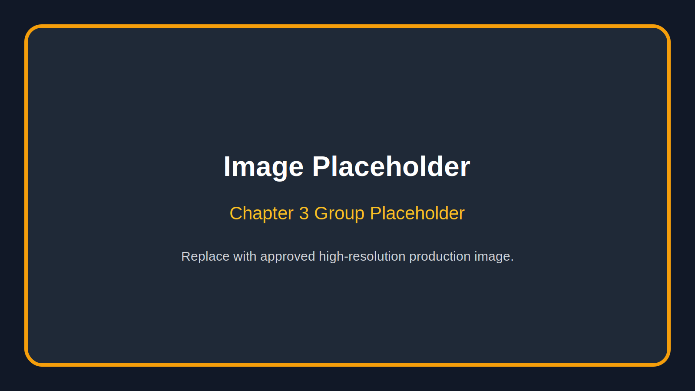

Lost Limb Riders exists because too many people fall into the space between medical treatment and real‑life recovery. Hospitals can save lives. Surgeons can close wounds. Therapists can build strength. Prosthetists can create life‑changing devices. Those professionals are essential. But after appointments end, people still go home to questions that cannot be solved by a prescription or a device alone.

Who do I call when I am scared?  
Who understands what this feels like?  
How do I talk to my family?  
How do I return to work?  
How do I handle strangers staring?  
How do I get my confidence back?  
How do I believe in my future again?

Lost Limb Riders exists to help answer those questions with community, mentorship, public awareness, practical resources, and a culture that refuses to let people disappear.

The need is urgent because limb loss affects more than the person who lost the limb. It affects households, employers, schools, churches, riding clubs, veteran communities, and local economies. It affects mental health systems, transportation access, disability awareness, and healthcare outcomes. When amputees are supported well, families stabilize, confidence increases, social participation improves, and communities become stronger.

Why now? Because people are tired of suffering quietly. Because conversations about mental health, disability inclusion, veteran support, adaptive recreation, and community resilience are happening everywhere, but they need real organizations on the ground to turn awareness into action. Because donors and companies are looking for causes with authentic leadership and measurable local impact. Because hospitals and prosthetic providers need trusted community partners. Because the next person facing limb loss should not have to wait years to find people who understand.

Lost Limb Riders is different because we combine credibility with culture. We are not a distant institution. We are not a one‑time event. We are not a motivational slogan without follow‑through. We are a relationship‑driven organization built around lived experience, peer support, service, education, and a recognizable identity.

Our motorcycle connection gives the organization energy, visibility, and belonging. Motorcycle culture understands road family. It understands loyalty, presence, grit, and showing up. But Lost Limb Riders is intentionally broader than riding. A person does not need a motorcycle to belong here. They need a willingness to move forward and a community willing to move with them.

We exist to make recovery less lonely. We exist to help families understand the journey. We exist to give sponsors a meaningful way to invest in resilience. We exist to create events where amputees are not side stories, but central voices. We exist to raise public awareness without exploiting pain. We exist to remind people that disability does not erase strength, masculinity, femininity, leadership, humor, beauty, faith, work ethic, or freedom.

Lost Limb Riders is built for the person who needs a first conversation and for the person ready to become a mentor. It is built for the hospital social worker looking for a trusted referral. It is built for the prosthetic company that wants to support more than equipment. It is built for the local business owner who wants sponsorship dollars to change actual lives. It is built for the volunteer who has been waiting for a mission worth their time.

The organization exists because healing should have witnesses. Rebuilding should have partners. Hope should have a name, a phone number, a meeting place, a ride route, a program calendar, and people ready to answer when someone reaches out.

# **Chapter 4: Mission, Vision & Values**

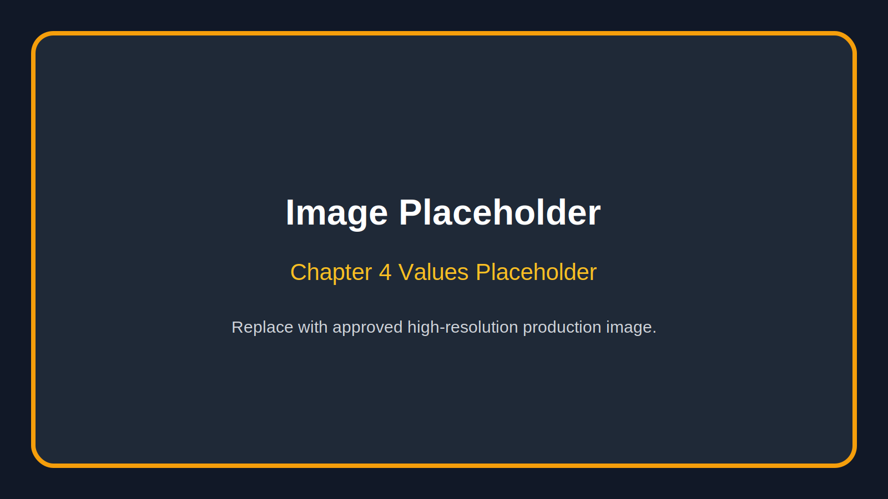

## **Mission Statement**

Lost Limb Riders exists to support amputees, limb‑different individuals, and their families through community, mentorship, public awareness, adaptive opportunities, and practical resources—including housing and independence advocacy—that restore hope, rebuild confidence, and remind every person that nobody is left behind and nobody stands alone.

## **Vision Statement**

Our vision is to become a trusted national model for post‑limb‑loss community support—connecting amputees and families with peer encouragement, accessible programs, public education, and partnerships that help people live boldly, independently, and with renewed purpose.

## **Core Values**

**Dignity**  
Every person deserves to be seen as whole, capable, and worthy of respect. Limb loss changes a body, but it does not reduce a life.

**Brotherhood and Sisterhood**  
We build real community. We believe people heal better when they are surrounded by others who show up consistently, listen honestly, and stand beside them without judgment.

**Courage**  
Courage is not pretending the road is easy. Courage is taking the next step anyway. We honor every act of progress, whether it happens in public or in private.

**Service**  
We serve with humility. We do not make people feel like burdens. We meet needs where we can, connect people where we cannot, and treat service as a privilege.

**Accountability**  
We handle resources responsibly, communicate honestly, and build programs that can be trusted by families, donors, partners, and the community.

**Inclusion**  
Lost Limb Riders welcomes amputees, limb‑different individuals, families, caregivers, veterans, riders, non‑riders, supporters, and allies. The road is wide enough for all of us.

**Resilience**  
We believe people can rebuild after devastating change. Resilience is not automatic; it is strengthened through support, opportunity, and daily practice.

**Authenticity**  
We tell the truth about hardship and hope. We do not use polished language to hide real pain, and we do not use pain to create pity. We speak with honesty, respect, and purpose.

These statements should guide every decision Lost Limb Riders makes. Programs, partnerships, events, speeches, media appearances, sponsorship packages, and volunteer training should all reflect the same foundation. If an opportunity helps restore dignity, reduce isolation, build confidence, educate the public, strengthen families, and move the mission forward, it belongs in the conversation. If it distracts from those priorities, it should be reconsidered.

# **Chapter 5: The Lost Limb Riders Promise**

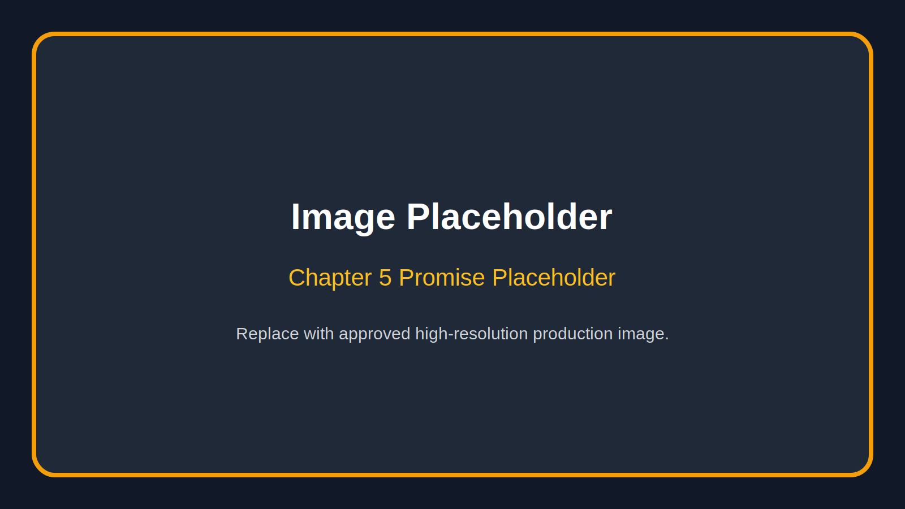

We promise every person who walks through our doors that they will be treated with dignity, respect, compassion, and understanding. We know the journey of limb loss is different for every individual, but no one should have to walk it alone.

We are committed to building a brotherhood and sisterhood in community where hope is restored, confidence is rebuilt, and every member knows they have a place.

Nobody Is Left Behind.

Nobody Stands Alone.

I Can. I Will.

This promise is the heartbeat of Lost Limb Riders. It is simple enough to remember and strong enough to build an organization around. It should be printed in volunteer materials, read at orientation, included in sponsor packets, and spoken at major events. It is not a decorative paragraph. It is a standard.

To treat people with dignity means we do not define them by their limb loss. We ask before assuming. We listen before advising. We respect privacy. We do not turn someone’s pain into a performance. We do not use someone’s story for promotion without consent. We speak to people directly, not around them. We recognize that every person’s journey is different.

To treat people with compassion means we make room for hard days. We understand that progress can be uneven. We do not shame people for frustration, grief, fear, or fatigue. We encourage without pressuring. We help without taking over. We celebrate wins without pretending struggle has disappeared.

To treat people with understanding means we commit to learning. Even leaders with lived experience must remember that no two amputees are the same. A traumatic amputation is different from a medical amputation. An upper‑limb amputation can carry different daily challenges than a lower‑limb amputation. A child’s experience differs from an adult’s. Veterans, workers injured on the job, accident survivors, cancer survivors, and people with congenital limb difference may all carry unique histories.

The promise also applies to families. Caregivers are often exhausted. Spouses may be scared. Parents may feel helpless. Children may need reassurance. Lost Limb Riders should be a place where families can ask questions, receive encouragement, and learn how to support their loved one without losing themselves in the process.

The promise applies to volunteers and partners too. We will build a culture where people know what is expected, where service is organized, and where commitments matter. Good intentions are valuable, but consistency changes lives. When someone in crisis is told help is coming, help must come. When a donor gives money for a program, that money must be used responsibly. When a hospital refers a patient, that patient must be treated with care.

The Lost Limb Riders Promise is how we protect the soul of the organization as it grows. Growth can bring attention, money, events, and opportunity. Those things are useful only if they strengthen the mission. The promise keeps the focus where it belongs: on people.

# **Chapter 6: Brotherhood and Sisterhood in Community**

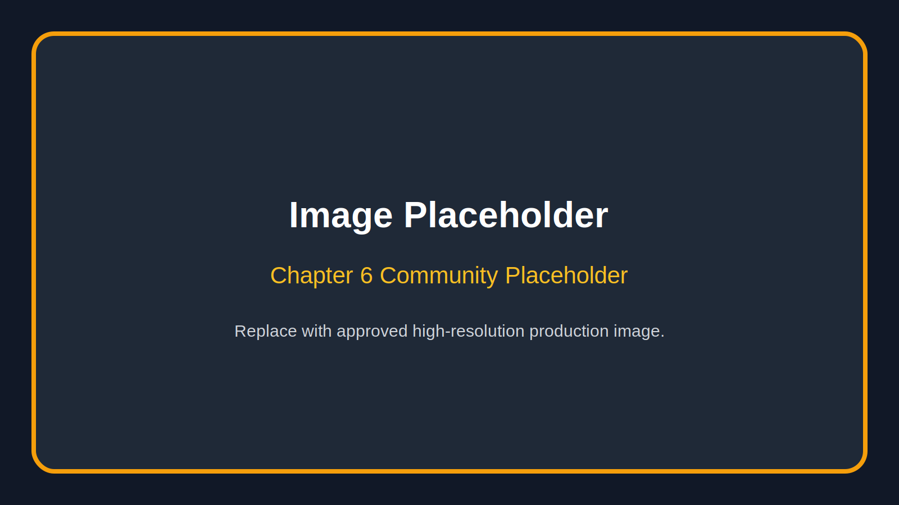

Lost Limb Riders is not just motorcycles. It is not just amputees. It is people helping people.

Motorcycles give the organization a powerful symbol. They represent freedom, motion, independence, and the courage to keep riding after life has changed. They also create visibility. A group of riders arriving together makes people look. That attention can be used for good—to raise awareness, start conversations, and show the public that limb loss does not erase strength or identity.

But the deeper culture is community. Brotherhood and sisterhood mean nobody is reduced to a diagnosis. Members are not clients in a line. They are people with names, stories, talents, struggles, and something to contribute. Some may need support today and become mentors tomorrow. Some may never ride but may become powerful advocates, volunteers, speakers, organizers, donors, or friends.

Community is built through repeated acts of presence. It is the check‑in call after surgery. It is the ride where a new amputee is invited to attend without pressure. It is the volunteer who helps set up chairs. It is the spouse who finally meets another spouse who understands. It is the group text before a hard appointment. It is the hospital visit, the fundraiser, the meal train, the adaptive activity, the shared laugh, and the honest conversation that reminds someone they still belong.

A healthy community has standards. Lost Limb Riders should be welcoming, but it should also be safe. Members and volunteers should treat one another with respect. The organization should not tolerate harassment, exploitation, discrimination, reckless behavior, intimidation, or the use of someone’s vulnerability for personal gain. Brotherhood and sisterhood are not excuses for poor conduct. They are commitments to protect one another.

The community should also avoid the trap of forced positivity. People do not need to be told to be grateful for trauma. They need room to grieve and encouragement to keep going. Lost Limb Riders can be hopeful without being fake. It can be strong without being harsh. It can be inspiring without denying reality.

“Nobody Is Left Behind. Nobody Stands Alone.” Those words should shape how members show up. If someone misses meetings, we check on them. If someone is newly injured, we welcome them. If someone is overwhelmed by paperwork or appointments, we help connect them to resources. If a family feels lost, we listen. If a member is celebrating a milestone, we celebrate with them.

Brotherhood and sisterhood also mean shared responsibility. The founder can set the vision, but the community must carry it. Board members must govern with integrity. Volunteers must follow through. Partners must respect the mission. Members must help build the culture they want to receive. A movement becomes strong when everyone understands they are not merely attending; they are contributing.

Lost Limb Riders should feel like a place where grit and tenderness can stand in the same room. A person can talk about pain and still laugh. They can be tough and still ask for help. They can be independent and still belong. They can ride, walk, roll, limp, lean, or arrive however they need to arrive—and still be fully part of the family.

# **Chapter 7: Programs**

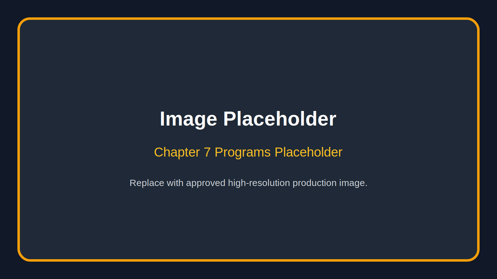

Programs are how the mission becomes real. Each program should be designed with a clear purpose, simple intake process, defined audience, expected outcomes, and a path for future expansion. Lost Limb Riders can begin with manageable offerings and grow responsibly as funding, volunteers, partnerships, and community demand increase.

## **Peer Connection Program**

**Purpose:** To reduce isolation by connecting amputees and limb‑different individuals with trained peers who understand the emotional and practical realities of the journey.

**How it works:** Participants request connection through a referral form, hospital partner, website, event, or direct contact. A coordinator gathers basic information, including type of limb loss, stage of recovery, location, preferred communication method, and immediate needs. The organization then connects the participant with an appropriate peer volunteer when available.

**Who it serves:** Newly injured amputees, long‑term amputees seeking community, individuals preparing for amputation, limb‑different individuals, and families looking for support.

**Expected outcomes:** Reduced isolation, increased confidence, improved access to community resources, stronger emotional support, and earlier connection to people who understand.

**Future expansion:** Formal mentor training, background checks where appropriate, hospital‑approved visitation protocols, regional peer groups, virtual support circles, and specialized groups for veterans, women, youth, parents, and caregivers.

## **Family Support and Caregiver Awareness**

**Purpose:** To help families understand the limb‑loss journey and learn how to support loved ones without losing their own stability.

**How it works:** Lost Limb Riders offers family education sessions, informal support gatherings, resource handouts, and referrals to professional services when needed. Topics may include communication, independence, grief, home adaptation, emotional fatigue, transportation, intimacy, parenting, and workplace transitions.

**Who it serves:** Spouses, partners, parents, children, siblings, close friends, and caregivers.

**Expected outcomes:** Better communication, reduced caregiver isolation, healthier expectations, stronger family resilience, and more informed support at home.

**Future expansion:** Caregiver workshops, family retreat days, school‑age education resources, spouse support circles, and partnerships with counselors or social workers.

## **Ride Forward Program**

**Purpose:** To create visible, empowering events that help participants reconnect with freedom, movement, and community.

**How it works:** Ride Forward events may include escorted motorcycle rides, passenger opportunities where appropriate and safely managed, adaptive riding education referrals, safety briefings, community meetups, and family‑friendly gatherings at ride endpoints. Participation should be structured around safety, consent, accessibility, and clear communication.

**Who it serves:** Amputees, limb‑different individuals, riders, families, supporters, veterans, sponsors, and the broader public.

**Expected outcomes:** Increased public awareness, stronger community identity, sponsor engagement, participant confidence, and fundraising support for programs.

**Future expansion:** Annual signature rides, regional ride chapters, adaptive riding scholarships, safety partnerships, and media campaigns.

## **Hospital and Prosthetic Partner Outreach**

**Purpose:** To provide trusted community support to patients and families during or after medical care.

**How it works:** Lost Limb Riders builds relationships with hospitals, rehabilitation centers, prosthetic clinics, case managers, social workers, and therapists. Partners receive referral materials, handbook excerpts, contact cards, and information about programs. Visits or patient connections occur only through approved protocols and with consent.

**Who it serves:** Patients, families, medical teams, prosthetic providers, and discharge planners.

**Expected outcomes:** Earlier emotional support, smoother transition from clinical care to community life, increased awareness of peer resources, and stronger collaboration between medical and community systems.

**Future expansion:** Formal memorandums of understanding, facility presentations, discharge packet inserts, support videos, and regional referral networks.

## **Emergency Assistance and Resource Navigation**

**Purpose:** To help individuals and families identify urgent needs and connect with available assistance.

**How it works:** The organization maintains a vetted resource list for transportation, ramps, home modifications, prosthetic support organizations, disability services, mental health support, employment resources, and emergency relief. When funding allows, Lost Limb Riders may provide limited direct assistance through a transparent application process.

**Who it serves:** Amputees and families facing urgent practical barriers.

**Expected outcomes:** Reduced crisis pressure, improved resource access, faster connection to appropriate agencies, and stronger trust in the organization.

**Future expansion:** Microgrant fund, partner referral network, case navigation volunteers, transportation partnerships, and emergency home accessibility support.

## **Housing and Independence Advocacy**

**Purpose:** To ensure that no amputee faces a housing crisis alone when unsafe, inaccessible, or unstable housing threatens health, recovery, safety, or independence.

**How it works:** Lost Limb Riders helps members identify housing barriers, document practical accessibility needs, and connect with appropriate resources. The organization may advocate when housing conditions interfere with medically necessary care, mobility, hygiene, wound care, prosthetic use, transportation access, or safe daily living. Advocacy may include helping members communicate with landlords or housing providers, locating accessible housing options, connecting eligible members with rental application fee, security deposit, moving expense, utility, HUD, VA, state, local, and nonprofit resources, and building a volunteer network that can help members navigate paperwork, phone calls, appointments, and referrals.

**Who it serves:** Amputees, limb‑different individuals, veterans, families, caregivers, and members whose living conditions create barriers to healing, independence, or safe participation in daily life.

**Expected outcomes:** Safer housing conditions, stronger access to accessible housing, reduced crisis pressure, fewer recovery setbacks caused by preventable environmental barriers, improved hygiene and wound‑care consistency, stronger connection to public and nonprofit resources, and greater independence at home.

**Real‑world example:** An amputee recovering from limb loss may be medically instructed to clean and care for a wound every day, but that instruction becomes difficult or impossible when a housing provider fails to provide hot water. In that situation, housing is not a separate issue from healthcare. It directly affects infection prevention, dignity, healing, and quality of life. Lost Limb Riders will treat those moments as mission‑critical because independence cannot be rebuilt in unsafe or unsupported living conditions.

**Future expansion:** Accessible housing resource guides, landlord and housing provider education, partnerships with fair‑housing advocates and disability rights organizations, volunteer housing navigators, emergency relocation support when funding allows, and a referral network with HUD‑approved housing counselors, VA representatives, county agencies, legal aid providers, and nonprofit partners.

## **Confidence Through Adaptive Activity**

**Purpose:** To help participants rediscover movement, recreation, and personal achievement.

**How it works:** Lost Limb Riders partners with gyms, adaptive sports groups, riding instructors, outdoor programs, rehabilitation providers, and local businesses to create accessible opportunities. Activities may include fitness introductions, adaptive riding education, fishing days, range days where legal and appropriate, camping, walking groups, workshops, or community challenges.

**Who it serves:** Amputees, limb‑different individuals, family members, and supporters.

**Expected outcomes:** Increased confidence, improved social connection, stronger physical activity habits, and expanded sense of possibility.

**Future expansion:** Scholarship support, equipment partnerships, adaptive recreation calendar, youth opportunities, and annual challenge events.

## **Volunteer Service Corps**

**Purpose:** To organize volunteers into reliable teams that support events, outreach, member care, fundraising, transportation, communications, and administration.

**How it works:** Volunteers complete an application, orientation, role assignment, and code of conduct. Roles may include event setup, ride support, hospitality, photography, outreach calls, hospital packet assembly, fundraising help, sponsor relations, and accessibility support.

**Who it serves:** The entire organization and the people it supports.

**Expected outcomes:** Stronger operations, safer events, consistent follow‑through, and more sustainable growth.

**Future expansion:** Leadership tracks, regional volunteer captains, online training, annual volunteer recognition, and emergency response teams for member support.

# **Chapter 8: Speaking and Public Awareness**

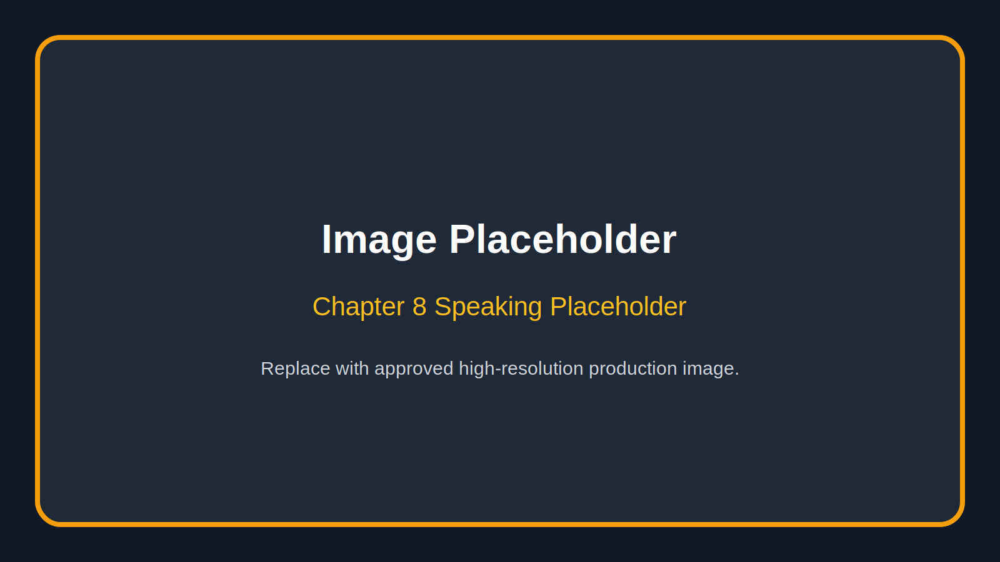

Lost Limb Riders has a speaking mission because stories can open doors that statistics alone cannot. Public awareness changes how communities respond to limb loss. It teaches people how to speak with respect, how to offer help without pity, how to design more inclusive spaces, and how to recognize strength without turning people into symbols.

The founder’s voice is central to this effort. A strong founder presentation can explain the personal journey, the reality of recovery, the creation of Lost Limb Riders, and the invitation for audiences to become part of the solution. The tone should be honest, grounded, and motivating. It should not sound rehearsed beyond recognition. It should sound like a real person telling the truth with purpose.

## **Schools**

School presentations can teach resilience, empathy, disability awareness, safe decision‑making, and respect for differences. Age‑appropriate programs may include the founder’s story, interactive questions, myths about amputees, bullying prevention, and the message that people are more than what happened to them.

## **Businesses**

Business presentations can focus on resilience, workplace inclusion, leadership through adversity, accessibility, disability hiring awareness, and corporate social responsibility. These talks can also help employers understand how to support employees returning after injury or medical crisis.

## **Churches and Faith Communities**

Faith communities are often places where people seek meaning after hardship. Lost Limb Riders can offer testimony‑style presentations, community support partnerships, volunteer opportunities, and practical ways congregations can serve families experiencing limb loss.

## **Hospitals and Rehabilitation Centers**

Healthcare presentations should be professional, respectful, and collaborative. Topics may include the patient experience after discharge, the importance of peer connection, family stress, confidence rebuilding, and how community organizations can complement clinical care.

## **Conferences and Civic Events**

Conference presentations can position Lost Limb Riders as a credible voice in disability inclusion, trauma recovery, nonprofit leadership, adaptive recreation, and community resilience. Civic groups can be invited to sponsor programs, host drives, volunteer, or connect the organization with local leaders.

## **Motorcycle Events**

Motorcycle events are natural spaces for awareness and fundraising. The message should honor riding culture while making clear that Lost Limb Riders is about service. Riders understand the road. Lost Limb Riders asks them to help make sure nobody travels the hardest miles alone.

## **Veterans Organizations**

Veterans may connect deeply with themes of service, injury, brotherhood, identity, and mission after trauma. Presentations should respect military experience without assuming all veterans share the same story. Partnerships can include peer support, events, adaptive activity, and family outreach.

Every speaking engagement should end with a clear invitation: volunteer, sponsor, refer, host, donate, attend, or share the mission. Awareness is valuable, but action is what turns a speech into impact.

# **Chapter 9: Events**

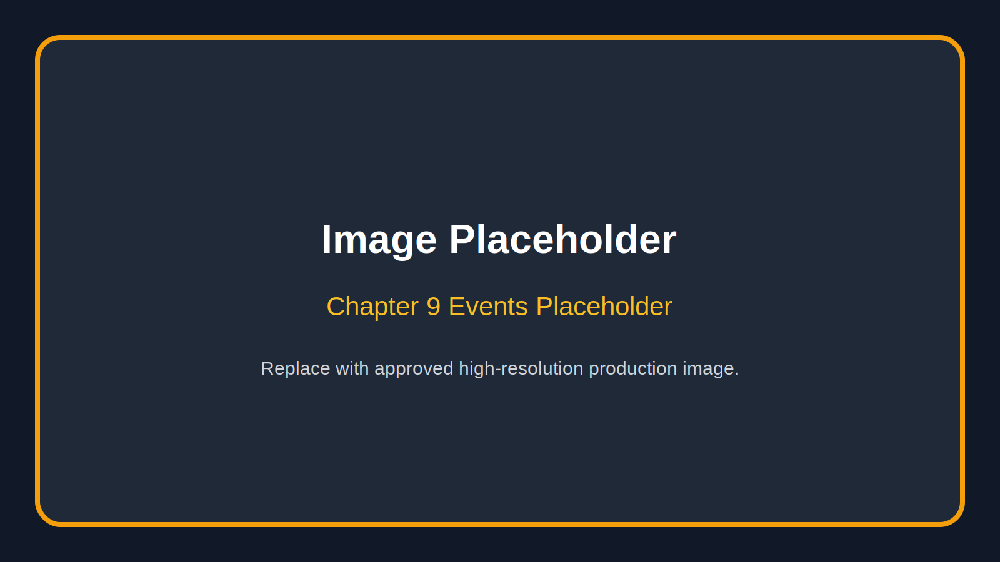

Events give the public a way to experience the mission. They create connection, visibility, fundraising, volunteer engagement, and media opportunities. A strong event calendar should include both signature events and smaller gatherings that keep the community connected throughout the year.

## **Ride Forward**

Ride Forward should become the signature event of Lost Limb Riders. It can be designed as an annual awareness ride and community gathering that brings together amputees, families, riders, sponsors, medical partners, local businesses, and supporters. The event should include a safe ride route, registration, sponsor recognition, program displays, food, music, founder remarks, participant stories, and a call to action.

The emotional goal is simple: people should leave feeling like they witnessed resilience in motion. The practical goal is equally important: raise funds for programs, recruit volunteers, build partnerships, and connect new participants to support.

## **Fundraisers**

Fundraisers may include benefit dinners, raffles where legal, auctions, motorcycle nights, restaurant partnerships, merchandise campaigns, golf outings, fitness challenges, and online giving campaigns. Each fundraiser should clearly state what the money supports. Donors give more confidently when they understand the impact.

## **Awareness Rides**

Smaller awareness rides can be held throughout the year in partnership with motorcycle clubs, dealerships, veterans groups, or local businesses. These rides should include safety planning, route coordination, volunteer roles, and a brief mission moment.

## **Family Events**

Family‑friendly events are essential because limb loss affects households. Picnics, cookouts, holiday gatherings, adaptive recreation days, and resource fairs can help families connect outside clinical settings. These events should be accessible, welcoming, and low pressure.

## **Volunteer Opportunities**

Volunteer events can include packet assembly days, facility cleanup, fundraising calls, hospital kit preparation, accessibility projects, sponsor outreach, and community service days. Volunteers stay engaged when they can see how their time directly supports people.

## **Event Standards**

Every event should have a clear purpose, written plan, accessibility review, safety plan, budget, sponsor package, volunteer assignments, registration process, photography consent process, and follow‑up plan. Events should never depend on memory alone. A production‑ready organization documents what works so it can repeat and improve.

# **Chapter 10: Corporate Partnerships**

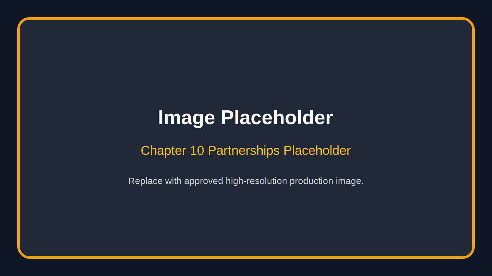

Corporate partnerships allow companies to invest in a mission that is visible, human, and deeply connected to community resilience. Lost Limb Riders offers partners a chance to support amputees and families in practical ways while aligning their brand with courage, inclusion, service, and hope.

Companies should work with Lost Limb Riders because the mission is authentic. It is led by lived experience. It serves a real need. It connects healthcare, disability awareness, mental health, family support, veteran communities, motorcycle culture, and local service. It provides opportunities for employee engagement, community goodwill, storytelling, and measurable impact.

## **Partnership Benefits**

Sponsors can receive recognition through event signage, website placement, social media mentions, printed materials, newsletters, press releases, speaking events, merchandise, and on‑site acknowledgments. Higher‑level partners may be invited to sponsor specific programs, underwrite transportation support, fund peer mentorship training, support hospital outreach materials, sponsor adaptive activity days, or become presenting sponsors for Ride Forward.

## **Community Impact**

Corporate dollars can support direct services such as peer connection, family support, emergency assistance, program materials, awareness campaigns, volunteer training, event accessibility, and resource navigation. The organization should communicate impact through stories, numbers, photographs, and annual reporting.

## **Ideal Partners**

Ideal partners may include prosthetic companies, hospitals, rehabilitation centers, motorcycle dealerships, motorcycle gear companies, adaptive equipment providers, insurance agencies, law firms, construction companies, healthcare systems, veteran‑owned businesses, banks, credit unions, restaurants, civic organizations, and corporations with disability inclusion priorities.

## **Sponsor Philosophy**

Lost Limb Riders should treat sponsors as mission partners, not just logos. Sponsors should understand the people behind the cause. They should be thanked consistently, invited to events, shown the impact of their support, and given clear opportunities to continue involvement. At the same time, the organization must protect its integrity. Not every dollar is worth accepting if a partnership conflicts with the mission or compromises trust.

A strong partnership program should answer three questions for every company: What problem are we helping solve? What exactly will our support make possible? How will we know it mattered?

# **Chapter 11: Financial Stewardship**

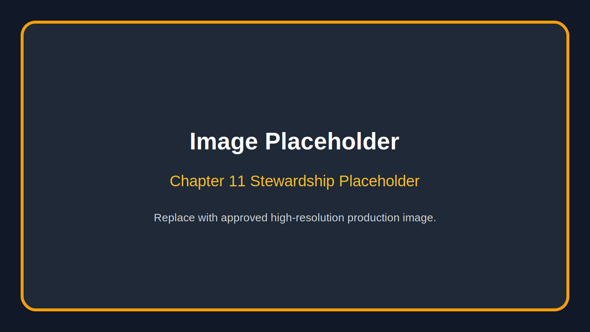

Trust is one of the most valuable assets a nonprofit can have. People give money, time, referrals, and reputation when they believe an organization will act with integrity. Lost Limb Riders must handle resources with transparency, accountability, and long‑term discipline.

Financial stewardship begins with clear priorities. Donations should support mission‑aligned work: programs, outreach, events, assistance, education, volunteer training, administrative systems, insurance, accessibility, communications, and responsible growth. The organization should avoid spending that looks impressive but does not serve people.

Transparency means donors should understand how contributions are used. That does not require exposing private recipient information or overwhelming supporters with technical reports. It means communicating clearly: funds supported a hospital outreach kit, a family support event, an adaptive activity day, emergency transportation, mentor training, printing, insurance, or event access. People want to know their generosity moved the mission forward.

Accountability requires systems. Lost Limb Riders should maintain budgets, receipts, approval processes, board oversight, conflict‑of‑interest policies, donation records, program tracking, and annual financial summaries. As the organization grows, it should seek professional accounting support and comply with all applicable nonprofit requirements.

Long‑term sustainability means not building programs that collapse after one event. A powerful first year is good. A stable fifth year is better. The organization should diversify revenue through individual donors, monthly giving, corporate sponsorships, grants, events, merchandise, major gifts, in‑kind donations, and program partnerships. No single funding source should control the future.

Financial communication should be plainspoken. Donors should not need a finance degree to understand the mission. A sponsor should be able to see that a specific investment creates a specific outcome. A family should know that assistance decisions are made fairly. A board member should be able to review spending and ask responsible questions.

Stewardship is also emotional. When someone gives to Lost Limb Riders, they are often giving because the mission touches something personal: a loved one, a veteran, a rider, a survivor, a patient, or their own memory of hardship. The organization must honor that trust. Every dollar should be treated as a tool for service.

# **Chapter 12: Five‑Year Vision**

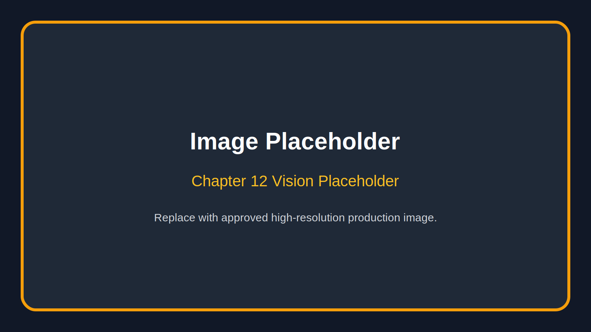

Five years from now, Lost Limb Riders should be known as a trusted, visible, and deeply human resource for amputees, families, and partners. The organization should still feel personal, but it should operate with enough structure to serve consistently.

## **Year One: Foundation**

The first year should focus on identity, organization, and pilot programs. Priorities include finalizing mission materials, forming or strengthening the board, building volunteer roles, launching the handbook, creating referral materials, hosting introductory events, building social media presence, developing sponsor packets, and piloting peer connection.

## **Year Two: Community Growth**

The second year should expand outreach. Lost Limb Riders should deepen relationships with hospitals, prosthetic providers, motorcycle groups, veterans organizations, churches, and local businesses. Ride Forward should become a recognizable annual event. Volunteer training should become more formal. Participant stories should be documented with consent.

## **Year Three: Program Strength**

By year three, programs should have clearer data and repeatable systems. The organization should track referrals, event attendance, volunteer hours, assistance provided, partner relationships, funds raised, and participant feedback. This information will strengthen grant applications and sponsor renewals.

## **Year Four: Regional Reach**

By year four, Lost Limb Riders can consider regional chapters, ambassador programs, virtual support groups, expanded adaptive activity partnerships, and stronger media outreach. Growth should be careful. Chapters should not launch without leadership standards, safety guidelines, financial controls, and brand consistency.

## **Year Five: Recognized Model**

By year five, Lost Limb Riders should be positioned as a model for community‑based limb‑loss support. The organization should have a stable donor base, annual report, signature event, trained volunteers, established partners, repeatable programs, and a clear path for the next five years.

The five‑year vision is not about becoming big for the sake of being big. It is about becoming strong enough to keep promises. If Lost Limb Riders grows, it should grow in depth, trust, and impact.

# **Chapter 13: Founder Biography**

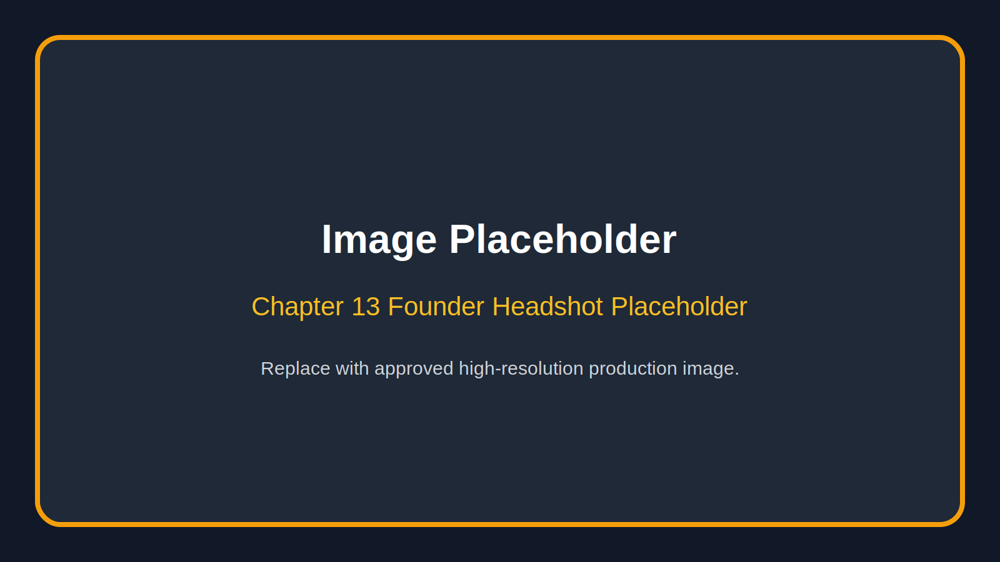

**[Founder Name]** is the founder of Lost Limb Riders, a community‑driven organization dedicated to supporting amputees, limb‑different individuals, and their families through mentorship, public awareness, adaptive opportunity, and brotherhood and sisterhood in community.

After experiencing limb loss personally, [Founder Name] came to understand that recovery does not end when medical treatment is complete. The physical journey is only one part of the story. Emotional healing, confidence, family support, financial pressure, and social connection all shape the path forward. That lived experience became the foundation for Lost Limb Riders.

[Founder Name] created the organization with a simple conviction: no one facing limb loss should have to rebuild alone. Through speaking, community events, peer connection, and partnerships, [Founder Name] works to help others find hope, courage, and practical support after life‑changing injury or medical crisis.

The motto “I Can. I Will.” reflects [Founder Name]’s belief that determination is built one decision at a time. The tagline “Nobody Is Left Behind. Nobody Stands Alone.” reflects the culture Lost Limb Riders is committed to creating for every member, family, volunteer, and partner.

**Media Topics:**  
Life after limb loss  
Motorcycle culture and recovery  
Disability awareness  
Peer support and community healing  
Resilience after trauma  
Family impact of amputation  
Nonprofit leadership rooted in lived experience  

**Approved short bio:**  
[Founder Name] is the founder of Lost Limb Riders, an organization supporting amputees, limb‑different individuals, and their families through community, mentorship, public awareness, and adaptive opportunity. Drawing from personal experience with limb loss, [Founder Name] speaks about resilience, dignity, and the power of making sure nobody is left behind and nobody stands alone.

**Contact:**  
Website: [Insert website]  
Email: [Insert email]  
Phone: [Insert phone]  
Social media: [Insert handles]  

# **Chapter 14: Call to Action**

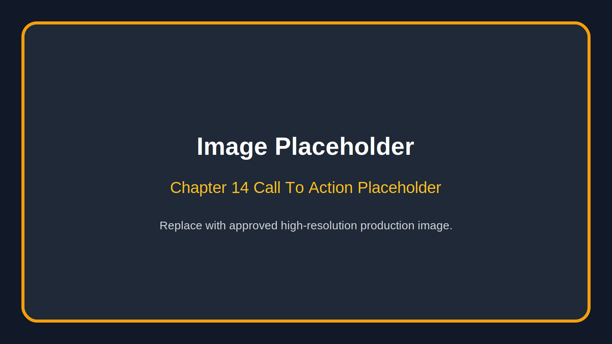

Lost Limb Riders is building something bigger than a program calendar. We are building a place for people who need hope to find it, for families who need support to receive it, and for communities that want to serve to take meaningful action.

If you are an amputee or limb‑different individual, we invite you to come as you are. You do not have to have everything figured out. You do not have to be inspirational on command. You do not have to be strong every minute. You only have to know that there is a place for you here.

If you are a family member or caregiver, we invite you to reach out. Your experience matters too. You deserve support, language, community, and encouragement as you walk beside someone you love.

If you are a hospital, rehabilitation center, prosthetic provider, counselor, therapist, or medical professional, we invite you to partner with us. Together, we can help bridge the gap between clinical care and community life.

If you are a company, sponsor, or donor, we invite you to invest in impact. Your support can help fund outreach, mentorship, events, emergency assistance, adaptive opportunities, and the systems required to serve people well.

If you are a rider, club, dealership, or motorcycle organization, we invite you to put the strength of the riding community behind a mission that belongs on the road. Help us carry the message where it needs to go.

If you are a volunteer, we invite you to show up with consistency. Skills matter, but presence matters too. A phone call, a ride day, a hospital packet, a meal, a chair set up before an event—these are not small things when they help someone feel less alone.

Lost Limb Riders is not asking people to pity amputees. We are asking people to stand with them. We are asking communities to recognize that recovery is not a solo mission. We are asking partners to help build a future where every person facing limb loss knows there is a brotherhood and sisterhood waiting for them.

Nobody Is Left Behind.

Nobody Stands Alone.

I Can. I Will.

## **Appendix A: Image Placement Guide**

Use high‑resolution images whenever possible. Avoid images that feel staged, exploitative, or overly polished. The visual identity should feel strong, honest, warm, and real.

**Cover:** Official logo and strong community image.  
**Founder Letter:** Founder portrait or founder beside motorcycle.  
**Our Story:** Open road, garage, or personal recovery image.  
**Reality of Limb Loss:** Rehabilitation, prosthetic fitting, or supportive care image.  
**Why We Exist:** Group image showing inclusion and strength.  
**Mission, Vision & Values:** Detail image of hands, patch, vest, prosthetic, or road.  
**Promise:** Members standing together.  
**Community:** Family‑friendly gathering.  
**Programs:** Collage of outreach and activity.  
**Speaking:** Founder at microphone or community presentation.  
**Events:** Registration, riders, volunteers, sponsor signage.  
**Partnerships:** Sponsor recognition image.  
**Stewardship:** Board or planning image.  
**Five‑Year Vision:** Road map graphic.  
**Founder Biography:** Professional headshot.  
**Call to Action:** Open road image.

## **Appendix B: Partner One‑Sheet Copy**

Lost Limb Riders supports amputees, limb‑different individuals, and their families through community, mentorship, public awareness, adaptive opportunities, and practical resources. Founded from lived experience, the organization exists to reduce isolation, rebuild confidence, and make sure nobody faces the journey of limb loss alone.

**Why partner with us:**  
Authentic mission rooted in lived experience  
Visible community impact  
Strong connection to motorcycle, veteran, healthcare, and disability communities  
Opportunities for employee engagement and public recognition  
Programs that serve individuals and families directly  

**Ways to support:**  
Sponsor Ride Forward  
Fund peer connection and family support  
Provide in‑kind goods or services  
Host a fundraising event  
Refer patients or families  
Volunteer at events  
Support emergency assistance and adaptive opportunities  

**Contact:** [Insert contact information]

## **Appendix C: Volunteer Commitment Statement**

As a Lost Limb Riders volunteer, I understand that this organization serves people who may be navigating pain, trauma, grief, uncertainty, and major life transition. I agree to treat every person with dignity, respect, compassion, and confidentiality. I will show up when I commit, communicate when I cannot, follow safety guidelines, respect leadership decisions, and protect the reputation and mission of Lost Limb Riders.

I understand that volunteering is not about attention. It is about service. I will help build a community where nobody is left behind, nobody stands alone, and every person is reminded that they still have value, purpose, and a place to belong.

**Volunteer name:** ______________________________  
**Signature:** ___________________________________  
**Date:** ________________________________________  
